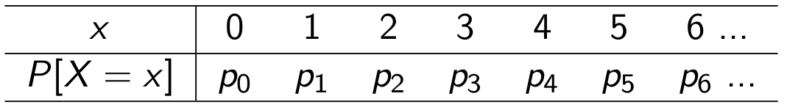

```{r, echo=FALSE,warning=FALSE,message=FALSE}
## Bibliotecas
library(compoisson)
library(COMPoissonReg)
library(RColorBrewer) 
library(latticeExtra)
library(wzRfun)

```


--- .segue bg:gray

## Introdução

---
## Dados de Contagem

> - Variável aleatória discreta
> - Assume somente um número enumerável de valores (finito ou infinito)
> - Representam o número de ocorrências de um evento em um intervalo de tempo ou espaço

> - Exemplos:
    > - Número de sinistros em um ano
    > - Número de ligações por mês em uma empresa de telefonia
    > - Número de frutos obtidos em uma árvore

---

## Distribuição de Probabilidades

> - 

> - 
```{r, fig.align='left',echo=FALSE, fig.width=10}

x <- 0:8
px <- dpois(x = x, lambda = 4)

plot(px ~ x, lwd = 5, axes=F, xlab="", ylab="", type="h")
axis(1, 0:8)
box()
```

--- .segue bg:gray

## Modelando Dados de Contagem

---

## Modelo Probabilístico Poisson

> - Função distribuição de probabilidade
    >  $$\begin{matrix}
    P(Y = y ; \lambda) = \frac{e^{-\lambda}\lambda^{y}}{y!} &  \text{  } \lambda > 0 
    \end{matrix}$$

> - Características:
    >  $E[Y] = \lambda$<p>
    >  $V[Y] = \lambda$

---

<iframe width="600" height="300" frameborder="0" scrolling="no" marginheight="0" marginwidth="0"
   src="http://200.17.213.89:3838/eduardo/pois">
</iframe>

---

--- .segue bg:gray

## Distribuição COM-Poisson

---

## Modelo Probabilístico COM - Poisson

> - Richard Conway e William Maxwell (1962)

> - Função distribuição de probabilidade
    >  $$\begin{align*}
    P(Y = y; \lambda,& \nu) = \frac{\lambda^{y}}{(y!)^{\nu}Z(\lambda, \nu)} \qquad \lambda > 0, \nu \geqslant 0\\
    &Z(\lambda, \nu) = \sum_{j=0}^{\infty}\frac{\lambda^{j}}{(j!)^{\nu}}    
    \end{align*}$$

> - Características:
    >  $E[Y] = \sum_{j=0}^{\infty}\frac{j\lambda^{j}}{(j!)^{\nu} Z(\lambda, \nu)}$<p>
    >  $V[Y] = \sum_{j=0}^{\infty}\frac{j^2\lambda^{j}}{(j!)^{\nu} Z(\lambda, \nu)} - E^2[Y]$

---

## Vantagens

```{r, echo=FALSE}
## Parâmetros
lambda = 3
lambda.sup = 1.56; nu.sup = 0.5
lambda.sub = 5.66; nu.sub = 1.5

## Probabilidades
x <- 0:8
px <- dpois(x, lambda)
py.sup <- dcom(x, lambda.sup, nu.sup)
py.sub <- dcom(x, lambda.sub, nu.sub)

## Medidas
mu.sup <- com.mean(lambda.sup, nu.sup)
mu.sub <- com.mean(lambda.sub, nu.sub)
var.sup <- com.var(lambda.sup, nu.sup)
var.sub <- com.var(lambda.sub, nu.sub)

## Sub-Legendas
l.equi <- sprintf("Média:%1.2f\nVariância:%1.2f", lambda, lambda)
l.sup <- sprintf("Média:%1.2f\nVariância:%1.2f", mu.sup, var.sup)
l.sub <- sprintf("Média:%1.2f\nVariância:%1.2f", mu.sub, var.sub)
```

```{r, fig.align='center', fig.width=12, echo=FALSE}
##--------------------------------------------
## Gráfico

cols <- c(
#  "blue", 
  1 
#  "gray50"
  )

m <- matrix(c(1, 2), nrow = 2, byrow = TRUE)
layout(mat = m, heights = c(0.08, 0.7))
## Adicionando a legenda
par(mar = c(0, 0, 2, 0))
plot(1, type = "n", axes=FALSE, xlab="", ylab="")
legend(x = "center", inset=0, cex=1, lwd=2,
       legend =
           c(
#             "Subdispersão",
             "Equidispersão"
#             "Superdispersão"
             ),
       col = cols, bty="n", lty=1, horiz=TRUE)
## Gráfico de Probabilidade
par(mar = c(5, 4, 1, 2) + 0.1)
plot(py.sub ~ x, type="n", axes=F,
     xlab="", ylab=expression(P(X==x)))
grid()
axis(1, 0:8); axis(2, seq(0, 0.4, by=0.1))
box()
lines(x = x, y = px, type = "h", lwd=4)
#lines(x = x + 0.15, y = py.sub, type = "h", col = cols[1], lwd=4)
#lines(x = x - 0.15, y = py.sup, type = "h", col = cols[3], lwd=4)
## Sub-legenda com valores de média e variância
mtext(l.equi, adj=0.5, line=4, side=1)
#mtext(l.sub, adj=0, line=4, side=1, col=cols[2])
#mtext(l.sup, adj=1, line=4, side=1, col=cols[3])
```

---

## Vantagens

```{r, fig.align='center', fig.width=12, echo=FALSE}
##--------------------------------------------
## Gráfico

cols <- c(
  "blue", 
  1 
#  "gray50"
  )

m <- matrix(c(1, 2), nrow = 2, byrow = TRUE)
layout(mat = m, heights = c(0.08, 0.7))
## Adicionando a legenda
par(mar = c(0, 0, 2, 0))
plot(1, type = "n", axes=FALSE, xlab="", ylab="")
legend(x = "center", inset=0, cex=1, lwd=2,
       legend =
           c(
             "Subdispersão",
             "Equidispersão"
#             "Superdispersão"
             ),
       col = cols, bty="n", lty=1, horiz=TRUE)
## Gráfico de Probabilidade
par(mar = c(5, 4, 1, 2) + 0.1)
plot(py.sub ~ x, type="n", axes=F,
     xlab="", ylab=expression(P(X==x)))
grid()
axis(1, 0:8); axis(2, seq(0, 0.4, by=0.1))
box()
lines(x = x, y = px, type = "h", lwd=4)
lines(x = x + 0.15, y = py.sub, type = "h", col = cols[1], lwd=4)
#lines(x = x - 0.15, y = py.sup, type = "h", col = cols[3], lwd=4)
## Sub-legenda com valores de média e variância
mtext(l.equi, adj=0.5, line=4, side=1)
mtext(l.sub, adj=0, line=4, side=1, col=cols[1])
#mtext(l.sup, adj=1, line=4, side=1, col=cols[3])
```

---

## Vantagens

```{r, fig.align='center', fig.width=12, echo=FALSE}
##--------------------------------------------
## Gráfico

cols <- c(
#  "blue", 
  1 ,
  "gray30"
  )

m <- matrix(c(1, 2), nrow = 2, byrow = TRUE)
layout(mat = m, heights = c(0.08, 0.7))
## Adicionando a legenda
par(mar = c(0, 0, 2, 0))
plot(1, type = "n", axes=FALSE, xlab="", ylab="")
legend(x = "center", inset=0, cex=1, lwd=2,
       legend =
           c(
#             "Subdispersão",
             "Equidispersão",
             "Superdispersão"
             ),
       col = cols, bty="n", lty=1, horiz=TRUE)
## Gráfico de Probabilidade
par(mar = c(5, 4, 1, 2) + 0.1)
plot(py.sub ~ x, type="n", axes=F,
     xlab="", ylab=expression(P(X==x)))
grid()
axis(1, 0:8); axis(2, seq(0, 0.4, by=0.1))
box()
lines(x = x, y = px, type = "h", lwd=4)
#lines(x = x + 0.15, y = py.sub, type = "h", col = cols[1], lwd=4)
lines(x = x - 0.15, y = py.sup, type = "h", col = cols[2], lwd=4)
## Sub-legenda com valores de média e variância
mtext(l.equi, adj=0.5, line=4, side=1)
#mtext(l.sub, adj=0, line=4, side=1, col=cols[1])
mtext(l.sup, adj=1, line=4, side=1, col=cols[2])
```

---

## Vantagens

```{r, fig.align='center', fig.width=12, echo=FALSE}
##--------------------------------------------
## Gráfico

cols <- c(
  "blue", 
  1 ,
  "gray30"
  )

m <- matrix(c(1, 2), nrow = 2, byrow = TRUE)
layout(mat = m, heights = c(0.08, 0.7))
## Adicionando a legenda
par(mar = c(0, 0, 2, 0))
plot(1, type = "n", axes=FALSE, xlab="", ylab="")
legend(x = "center", inset=0, cex=1, lwd=2,
       legend =
           c(
             "Subdispersão",
             "Equidispersão",
             "Superdispersão"
             ),
       col = cols, bty="n", lty=1, horiz=TRUE)
## Gráfico de Probabilidade
par(mar = c(5, 4, 1, 2) + 0.1)
plot(py.sub ~ x, type="n", axes=F,
     xlab="", ylab=expression(P(X==x)))
grid()
axis(1, 0:8); axis(2, seq(0, 0.4, by=0.1))
box()
lines(x = x, y = px, type = "h", lwd=4)
lines(x = x - 0.15, y = py.sub, type = "h", col = cols[1], lwd=4)
lines(x = x + 0.15, y = py.sup, type = "h", col = cols[3], lwd=4)
## Sub-legenda com valores de média e variância
mtext(l.equi, adj=0.5, line=4, side=1)
mtext(l.sub, adj=0, line=4, side=1, col=cols[1])
mtext(l.sup, adj=1, line=4, side=1, col=cols[3])
```

---

## Vantagens

> -  Pertence à família exponencial de distribuições

> - Tem como casos particulares os modelos:
    > - Poisson ($\nu = 1$)
    > - Bernoulli ($\nu = \infty$)
    > - Geométrica ($\nu = 0$ e $lambda < 1$) 

---

<iframe width="600" height="300" frameborder="0" scrolling="no" marginheight="0" marginwidth="0"
   src="http://200.17.213.89:3838/eduardo/com-pois">
</iframe>

---

## Desvantagens

> - $Z(\lambda, \nu) = \sum_{j=0}^{\infty}\frac{\lambda^{j}}{(j!)^{\nu}}$<p>
Quando $\nu = 0$ e $\lambda \geqslant 0$ não converge

> - Restrição no espaço paramétrico

> - Metódo de estimação por máxima verossimilhança é instável

---

## Desvantagens

```{r, echo=FALSE, message=FALSE, warning=FALSE}
## Parâmetros
lambda = 3
lambda.sup = 1.56; nu.sup = 0.5
lambda.sub = 5.66; nu.sub = 1.5

## Simulação
set.seed(12)
y.equi <- rpois(1000, lambda)
y.sup <- rcom(1000, lambda.sup, nu.sup)
y.sub <- rcom(1000, lambda.sub, nu.sub)

## Verossimilhanca

##--------------------------------------------
## Funções
ll <- function(theta, y){
    th1 <- theta[1]
    th2 <- theta[2]
    j <- 0:100
    z <- sum((exp(th1) ^ j) / (factorial(j) ^ exp(th2)))
    ll <- (y * th1) - exp(th2) * log(factorial(y)) - log(z)
    return(sum(ll))
}

llv <- Vectorize(
    FUN=function(th1, th2, y){
        ll(c(th1, th2), y=y)
    }, vectorize.args=c("th1", "th2"))

## Configurações gráficas
colr <- brewer.pal(11, "Spectral")
colr <- colorRampPalette(colr, space="rgb")
zlab <- "Log-Verossimilhança"
xlab <- expression((lambda))
ylab <- expression((nu))

## Sequencias
seql.equi <- seq(0.1, 1.7, l=30)
seqn.equi <- seq(-1, 1, l=30)
ll.equi <- outer(seql.equi, seqn.equi, llv, y = y.equi)
da.equi <- expand.grid(th1 = seql.equi, th2 = seqn.equi)
da.equi$logLik <- as.vector(ll.equi)

seql.sup <- seq(0, 1, l=30)
seqn.sup <- seq(-1.2, 0.5, l=30)
ll.sup <- outer(seql.sup, seqn.sup, llv, y = y.sup)
da.sup <- expand.grid(th1 = seql.sup, th2 = seqn.sup)
da.sup$logLik <- as.vector(ll.sup)

seql.sub <- seq(1, 2.2, l=30)
seqn.sub <- seq(0, 1.1, l=30)
ll.sub <- outer(seql.sub, seqn.sub, llv, y = y.sub)
da.sub <- expand.grid(th1 = seql.sub, th2 = seqn.sub)
da.sub$logLik <- as.vector(ll.sub)

```

```{r, fig.align='center', fig.height=6, fig.width=10, echo=FALSE}
wireframe(logLik ~ exp(th1) + exp(th2), data = da.sub,
          scales=list(arrows=FALSE), zlab=list(zlab, rot=90, cex=0.8),
          xlab=list(xlab, cex=0.8), ylab=list(ylab, cex=0.8),
          col="gray60", col.contour="gray40",
          panel.3d.wireframe="panel.3d.contour", type=c("bottom", "top"),
          col.regions=colr(100),  drape=TRUE,
          screen=list(z=60, x=-75))
```

>  Subdispersão ($\lambda$ = `r lambda.sub` e $\nu$ = `r nu.sub`)

---

## Desvantagens

```{r, fig.align='center', fig.height=6, fig.width=10, echo=FALSE}
wireframe(logLik ~ exp(th1) + exp(th2), data = da.sup,
          scales=list(arrows=FALSE), zlab=list(zlab, rot=90, cex=0.8),
          xlab=list(xlab, cex=0.8), ylab=list(ylab, cex=0.8),
          col="gray60", col.contour="gray40",
          panel.3d.wireframe="panel.3d.contour", type=c("bottom", "top"),
          col.regions=colr(100),  drape=TRUE,
          screen=list(z=60, x=-75))
```

>  Superdispersão ($\lambda$ = `r lambda.sup` e $\nu$ = `r nu.sup`)

---

## Desvantagens

```{r, fig.align='center', fig.height=6, fig.width=10, echo=FALSE}
wireframe(logLik ~ exp(th1) + exp(th2), data = da.equi,
          scales=list(arrows=FALSE), zlab=list(zlab, rot=90, cex=0.8),
          xlab=list(xlab, cex=0.8), ylab=list(ylab, cex=0.8),
          col="gray60", col.contour="gray40",
          panel.3d.wireframe="panel.3d.contour", type=c("bottom", "top"),
          col.regions=colr(100),  drape=TRUE,
          screen=list(z=60, x=-75))
```

>  Equidispersão ($\lambda$ = `r lambda` e $\nu$ = 1)

--- .segue bg:gray

## Propostas

---

## Métodos de Estimação

> 1. Comparar abordagens para máximização da log-verossimilhança
> 2. Estimar via mínimos quadrados ponderados
> 3. Estimar via abordagem bayesiana

---

## Modelos de Regressão

> 1. Comparar os modelos COM-Poisson com outras abordagens utilizadas (quasi-verossimilhança, binomial negativo, etc)

---

## Aspecto Computacional

 1. Implementar os métodos de estimação e comparação de modelos no software R.
 
  > - **compoisson** (Jeffrey Dunn - 2012)
  > - **COMPoissonReg** (Kimberly Sellers e Thomas Lotze - 2011)

---


<font size="50"><b>
<div style='text-align: center;'>Obrigado!</div>
</b></font>
