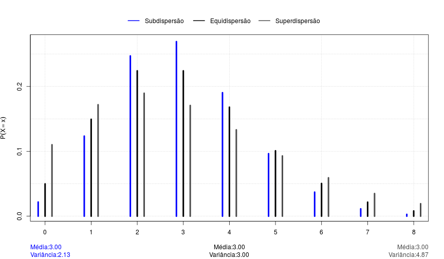
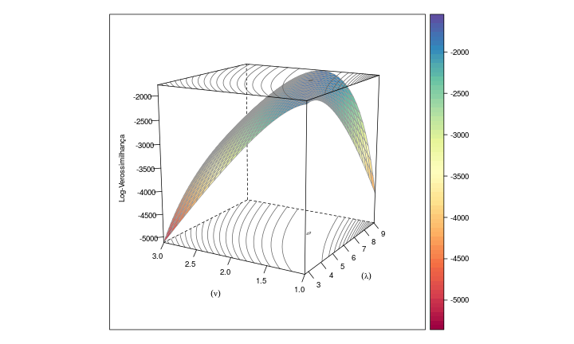
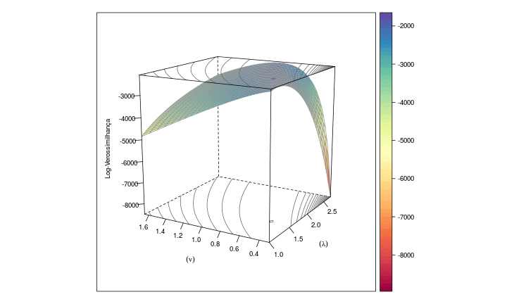
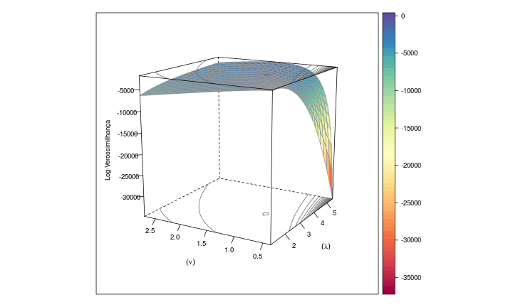

--- .segue bg:gray

## Introdução

---
## Dados de Contagem

> - Variável aleatória discreta
> - Assume somente um número enumerável de valores (finito ou infinito)
> - Representam o número de ocorrências de um evento em um intervalo de tempo ou espaço

> - Exemplos:
    > - Número de sinistros em um ano
    > - Número de ligações por mês em uma empresa de telefonia
    > - Número de frutos obtidos em uma árvore

---

## Distribuição de Probabilidades

> - 

> - 

--- .segue bg:gray

## Modelando Dados de Contagem

---

## Modelo Probabilístico Poisson

> - Função distribuição de probabilidade
    >  $$\begin{matrix}
    P(Y = y ; \lambda) = \frac{e^{-\lambda}\lambda^{y}}{y!} &  \text{  } \lambda > 0 
    \end{matrix}$$

> - Características:
    >  $E[Y] = \lambda$

    >  $V[Y] = \lambda$

---

<iframe width="600" height="300" frameborder="0" scrolling="no" marginheight="0" marginwidth="0"
   src="http://200.17.213.89:3838/eduardo/pois">
</iframe>

---

--- .segue bg:gray

## Distribuição COM-Poisson

---

## Modelo Probabilístico COM - Poisson

> - Richard Conway e William Maxwell (1962)

> - Função distribuição de probabilidade
    >  $$\begin{align*}
    P(Y = y; \lambda,& \nu) = \frac{\lambda^{y}}{(y!)^{\nu}Z(\lambda, \nu)} \qquad \lambda > 0, \nu \geqslant 0\\
    &Z(\lambda, \nu) = \sum_{j=0}^{\infty}\frac{\lambda^{j}}{(j!)^{\nu}}    
    \end{align*}$$

> - Características:
    >  $E[Y] = \sum_{j=0}^{\infty}\frac{j\lambda^{j}}{(j!)^{\nu} Z(\lambda, \nu)}$

    >  $V[Y] = \sum_{j=0}^{\infty}\frac{j^2\lambda^{j}}{(j!)^{\nu} Z(\lambda, \nu)} - E^2[Y]$

---

## Vantagens

---

## Vantagens

---

## Vantagens

---

## Vantagens

---

## Vantagens

> -  Pertence à família exponencial de distribuições

> - Tem como casos particulares os modelos:
    > - Poisson ($\nu = 1$)
    > - Bernoulli ($\nu = \infty$)
    > - Geométrica ($\nu = 0$ e $lambda < 1$) 

---

<iframe width="600" height="300" frameborder="0" scrolling="no" marginheight="0" marginwidth="0"
   src="http://200.17.213.89:3838/eduardo/com-pois">
</iframe>

---

## Desvantagens

> - $Z(\lambda, \nu) = \sum_{j=0}^{\infty}\frac{\lambda^{j}}{(j!)^{\nu}}$

Quando $\nu = 0$ e $\lambda \geqslant 0$ não converge

> - Restrição no espaço paramétrico

> - Metódo de estimação por máxima verossimilhança é instável

---

## Desvantagens

>  Subdispersão ($\lambda$ = 5.66 e $\nu$ = 1.5)

---

## Desvantagens

>  Superdispersão ($\lambda$ = 1.56 e $\nu$ = 0.5)

---

## Desvantagens

>  Equidispersão ($\lambda$ = 3 e $\nu$ = 1)

--- .segue bg:gray

## Propostas

---

## Métodos de Estimação

> 1. Comparar abordagens para máximização da log-verossimilhança
> 2. Estimar via mínimos quadrados ponderados
> 3. Estimar via abordagem bayesiana

---

## Modelos de Regressão

> 1. Comparar os modelos COM-Poisson com outras abordagens utilizadas (quasi-verossimilhança, binomial negativo, etc)

---

## Aspecto Computacional

 1. Implementar os métodos de estimação e comparação de modelos no software R.
 
  > - **compoisson** (Jeffrey Dunn - 2012)
  > - **COMPoissonReg** (Kimberly Sellers e Thomas Lotze - 2011)

---

<b>

Obrigado!

</b>
